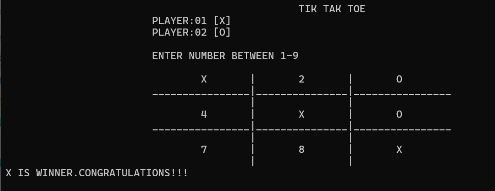

# Tic Tac Toe – Console Game in C++

This is a simple two-player Tic Tac Toe game developed in C++. It runs in the terminal/command line and allows players to take turns on a 3x3 grid by selecting positions using numbers 1 to 9.

---

## Overview

- The game starts with a blank 3x3 board.
- Players take turns entering a number (1–9) to place their symbol (`X` or `O`) on the board.
- After each move, the board updates and checks for a win or a draw.
- The game ends when a player wins or when the board is full (a draw).

---

## How to Play

1. Run the compiled program in your terminal.
2. Player 1 uses `X`, and Player 2 uses `O`.
3. Players input a number from 1 to 9 to mark a position on the grid.
4. The board updates after each turn and displays the current state.
5. The game announces the winner or declares a draw.

---

## Demo

